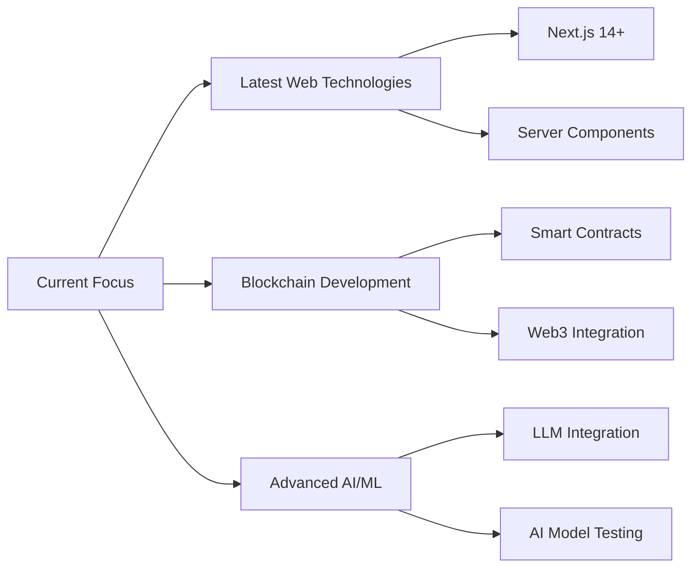

<div align="center">

# 👋 Hi, I'm Dulina Chandul


[](https://x.com/DulinaChandul)


</div>

---

## 🧑‍💻 About Me

```typescript
const dulina = {
    role: "Full-Stack Developer",
    passion: "Building AI-powered solutions for real-world problems",
    currentFocus: ["Latest Web Technologies", "AI/ML Integration", "Blockchain"],
    learningStyle: "Always experimenting with cutting-edge AI models",
    motto: "Code with purpose, innovate with passion"
};
```

🔥 **Gold Medalist** at SLIIT CodeFest 2024 (Senior Coding Competition)  
🏆 **Web Master Champion** in National Web Development Competition  
🥉 **2nd Runner-Up** at SLIIT CodeFest 2024  
🚀 Passionate about **AI, real-world solutions, and emerging technologies**  
🧪 Love testing the **latest AI models** and pushing boundaries  

---

## 🛠️ Tech Arsenal

<div align="center">

### Languages & Frameworks


### Frontend


### Backend


### AI & Tools


</div>

---

## 🚀 Featured Projects

<div align="center">

### 🌱 [GreenLoop](https://github.com/Dulina-Chandul/Greenloop)
**AI-Powered Smart Waste Marketplace**

[](https://github.com/Dulina-Chandul/Greenloop)

Revolutionizing waste management with AI! 🤖  
🔹 **MERN Stack** + **Google Gemini AI**  
🔹 **Reverse Auctions** with Real-time Bidding  
🔹 **AI Scrap Recognition** & Smart Geo-Matching  
🔹 Live Market Map with **Socket.io** & **Leaflet**

```
Tech: React • TypeScript • Node.js • MongoDB • Gemini AI • Socket.io
```

---

### 🎓 [EduNexus](https://github.com/Dulina-Chandul/EduNexus)
**AI-Powered Smart Solutions for School Life**

[](https://github.com/Dulina-Chandul/EduNexus)

Transforming education with personalized AI solutions! 📚  
🔹 Intelligent learning recommendations  
🔹 Smart school management features  
🔹 AI-driven personalization

```
Tech: JavaScript • React • Node.js • Express
```

---

### 📖 [Prathibha.lk](https://github.com/Dulina-Chandul/prathibha-lk-dev)
**AI-Powered English Learning Platform**

[](https://github.com/Dulina-Chandul/prathibha-lk-dev)

Making English learning accessible through AI! 🌐  
🔹 Interactive learning modules  
🔹 AI-powered feedback & assessments  
🔹 Personalized learning paths

```
Tech: JavaScript • React • Node.js • AI Integration
```

</div>

---

## 📊 GitHub Analytics

<div align="center">


</div>

<div align="center">

[](https://git.io/streak-stats)

</div>

<div align="center">


</div>

---

## 🏆 Achievements & Milestones

<div align="center">

| 🏅 Achievement | 📅 Year | 🎯 Category |
|:---|:---:|:---|
| 🥇 **Gold Medal** - SLIIT CodeFest | 2024 | Senior Coding Competition |
| 🥉 **2nd Runner-Up** - SLIIT CodeFest | 2024 | National Competition |
| 🏆 **Champion** - Web Master | 2024 | Web Development |
| 🎖️ Multiple Competition Participations | 2024 | Various Categories |

</div>

---

## 🌱 Currently Learning

<div align="center">



</div>

---

## 💬 Let's Connect!

<div align="center">

[](https://x.com/DulinaChandul)
[](https://discord.com)
[](https://github.com/Dulina-Chandul)

**Open to collaborations on AI-powered solutions and innovative projects!** 🤝

</div>

---

## ⚡ Fun Facts

```javascript
const dailyRoutine = {
    morning: "☕ Coffee + Code Review",
    afternoon: "💻 Building innovative solutions",
    evening: "🤖 Testing latest AI models",
    night: "📚 Learning new technologies",
    weekend: "🏆 Participating in coding competitions"
};

console.log("Always staying updated with the tech industry! 🚀");
```

---

<div align="center">

### 💭 Quote of the Day


---

### 📈 Contribution Snake


---


**Thanks for visiting! Let's build something amazing together! 🚀**

[](https://github.com/Dulina-Chandul)

</div>
