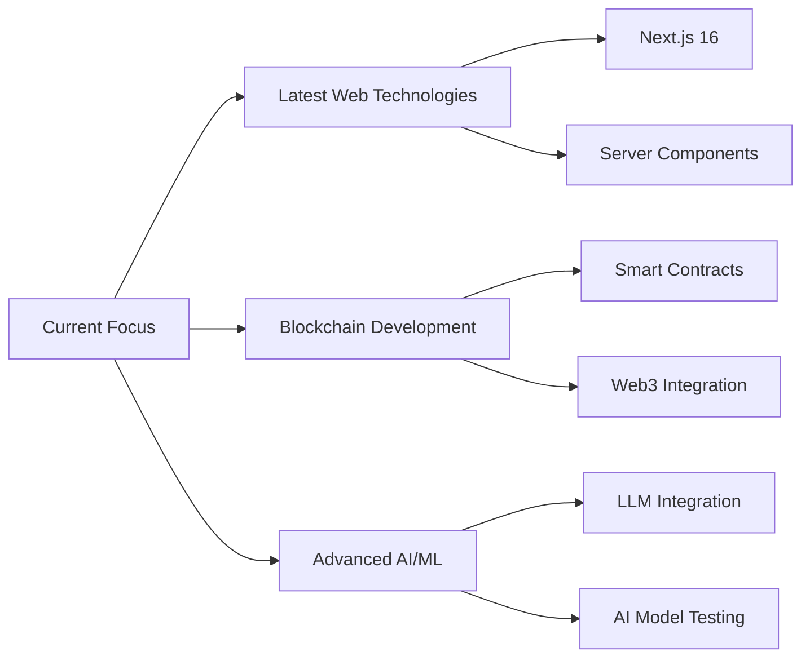

<div align="center">

# 👋 Hi, I'm Dulina Chandul


[](https://x.com/DulinaChandul)


</div>

---

## 🧑‍💻 About Me

```typescript
const dulina = {
    role: "Full-Stack Developer",
    passion: "Building AI-powered solutions for real-world problems",
    currentFocus: ["Latest Web Technologies", "AI/ML Integration", "Blockchain"],
    learningStyle: "Always experimenting with cutting-edge AI models",
    motto: "Code with purpose, innovate with passion"
};
```  

---

## 🛠️ Tech Arsenal

<div align="center">

### Languages & Frameworks


### Frontend


### Backend


### AI & Tools


</div>

---

## 🚀 Featured Projects

<table>
<tr>
<td width="50%">

### 🌱 GreenLoop

<a href="https://github.com/Dulina-Chandul/Greenloop">

</a>

**AI-Powered Smart Waste Marketplace** ♻️

Revolutionizing waste management with cutting-edge AI technology! Building a sustainable future through intelligent scrap recognition, real-time reverse auctions, and geo-matched waste collection.

**🎯 Key Features:**
- 🤖 Google Gemini AI for scrap recognition
- ⚡ Real-time bidding with Socket.io
- 🗺️ Live market map with Leaflet
- 🎪 Reverse auction system

**💻 Tech Stack:**
```
React • TypeScript • Node.js • MongoDB
Gemini AI • Socket.io • Cloudinary
```

[](https://github.com/Dulina-Chandul/Greenloop)

</td>
<td width="50%">

### 🎓 EduNexus

<a href="https://github.com/Dulina-Chandul/EduNexus">

</a>

**AI-Powered Smart School Management** 📚

Transforming education with personalized AI solutions! A comprehensive platform that brings intelligence to school life, making education management seamless and efficient.

**🎯 Key Features:**
- 🧠 Intelligent learning recommendations
- 📊 Smart school management system
- 🎯 AI-driven personalization
- 📈 Student progress tracking

**💻 Tech Stack:**
```
JavaScript • React • Node.js
Express • MongoDB • AI Integration
```

[](https://github.com/Dulina-Chandul/EduNexus)

</td>
</tr>
<tr>
<td width="50%">

### 📖 Prathibha.lk

<a href="https://github.com/Dulina-Chandul/prathibha-lk-dev">

</a>

**AI-Powered English Learning Platform** 🌐

Making English learning accessible and engaging through AI! An innovative e-learning solution designed to help students master English with personalized, intelligent guidance.

**🎯 Key Features:**
- 📝 Interactive learning modules
- 🤖 AI-powered feedback system
- 🎯 Personalized learning paths
- 📊 Progress tracking & analytics

**💻 Tech Stack:**
```
JavaScript • React • Node.js
AI Integration • Responsive Design
```

[](https://github.com/Dulina-Chandul/prathibha-lk-dev)

</td>
<td width="50%">

### 💡 More Projects Coming Soon...

Currently working on exciting new projects involving:
- 🔗 **Blockchain Integration**
- 🤖 **Advanced AI/ML Models**
- 🌐 **Web3 Technologies**
- 🚀 **Cutting-edge Web Apps**

Stay tuned! ⭐

</td>
</tr>
</table>

---

## 📊 GitHub Analytics

<p align="center">
  <a href="https://github.com/Dulina-Chandul">
    
    
  </a>
</p>

<p align="center">
  
</p>

---

## 🏆 Achievements & Milestones

<div align="center">

| 🏅 Achievement | 📅 Year | 🎯 Category |
|:---|:---:|:---|
| 🥇 **Gold Medal** - SLIIT CodeFest | 2024 | Senior Coding Competition |
| 🥉 **2nd Runner-Up** - SLIIT CodeFest | 2024 | National Competition |
| 🏆 **Champion** - Web Master | 2024 | Web Development |
| 🎖️ Multiple Competition Participations | 2024 | Various Categories |

</div>

---

## 🌱 Currently Learning

<div align="center">



</div>

---

## 💬 Let's Connect!

<div align="center">

[](https://x.com/DulinaChandul)
[](https://discord.com)
[](https://github.com/Dulina-Chandul)

**Open to collaborations on AI-powered solutions and innovative projects!** 🤝

</div>

---


<div align="center">


</div>
